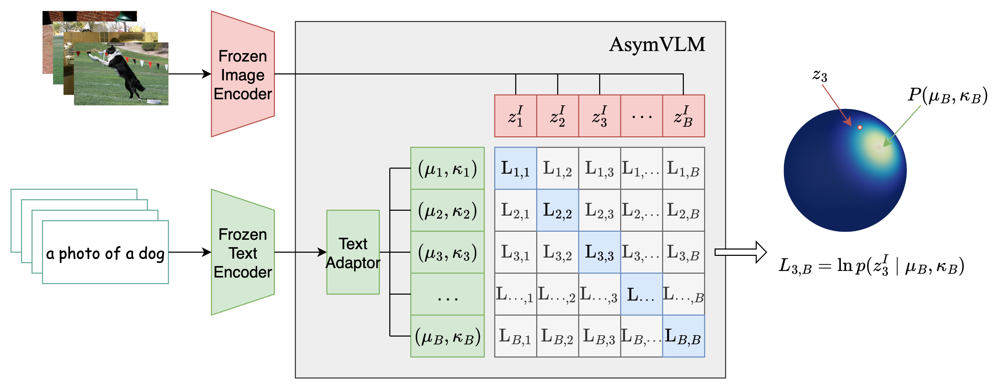

# AsymVLM: Official PyTorch Implementation

This repository contains the implementation of our paper, "[Exploiting the Asymmetric Uncertainty Structure of Pre-trained VLMs on the Unit Hypersphere](https://neurips.cc/virtual/2025/poster/116582)," accepted at NeurIPS 2025.

## Overview
AsymVLM is a post-hoc adaptation method for pre-trained vision-language models (VLMs) that models the uncertainty of text embeddings on the unit hypersphere. This implementation supports two distributional families for this purpose:
- von Mises-Fisher (vMF)
- Power Spherical (PSD)



## llustrative Example
AsymVLM captures aleatoric uncertainty in text embeddings. As a prompt becomes more descriptive, its uncertainty measure (i.e., the inverse concentration $\kappa^{-1}$ for the vMF/PS distribution) decreases monotonically:
```
Prompt                                             Uncertainty
-------------------------------------------------  ----------
a photo                                            4.4939e-01
a photo of a cat                                   2.1371e-01
a photo of a black cat                             1.6452e-01
a photo of a black cat with green eyes             1.3495e-01
a photo of a black cat with big dark green eyes    1.3059e-01
```

## Installation

1. Install the required dependencies:
```sh
pip install -r requirements.txt
```

## Usage

### 1. Cache Embeddings

First, cache the CLIP embeddings for the dataset. Before running the code, you need to specify the path to the data and corresponding annotation files
in [`cache_embeddings.py`](cache_embeddings.py), line 11-19. Then run
```sh
python cache_embeddings.py --dataset coco
```

### 2. Train the Adaptor

Train the AsymVLM adaptor with either VMF or PSD distribution:

```sh
python train.py --dataset coco --method asymvlm-psd --seed 0
```

Options for `--method`:
- `asymvlm-psd`: Power Spherical Distribution
- `asymvlm-vmf`: von Mises-Fisher Distribution
- `probvlm`: ProbVLM
- `pfe`: PFE
- `pcmepp`: PCME++
- `prolip`: ProLIP

### 3. Evaluate the Model

Evaluate the trained model on cross-modal retrieval tasks:

```sh
python eval.py --dataset coco --method asymvlm-psd --seed 0 --uncer_levels 10
```

## Project Structure

```
.
├── datasets/
│   ├── coco.py
│   └── embedding.py
├── models/                 # Method implementation
│   ├── asymvlm/
│   ├── pcmepp/
│   ├── pfe/
│   ├── probvlm/
│   └── prolip/
├── utils/
│   ├── preprocess.py
│   └── seed.py
├── cache_embeddings.py     # Script for CLIP embeddings caching
├── train.py                # Training script
├── eval.py                 # Evaluation script
└── requirements.txt        # Project dependencies
```

## Citation

If you find this code useful for your research, please cite our paper:

```bibtex
@article{ju2025exploiting,
    title={Exploiting the Asymmetric Uncertainty Structure of Pre-trained VLMs on the Unit Hypersphere},
    author={Ju, Li and Andersson, Max and Fredriksson, Stina and Gl{\"o}ckner, Edward and Hellander, Andreas and Vats, Ekta and Singh, Prashant},
    booktitle = {NeurIPS},
    year = {2025}
}
```

## License
[CC-BY-4.0](LICENSE.md)
